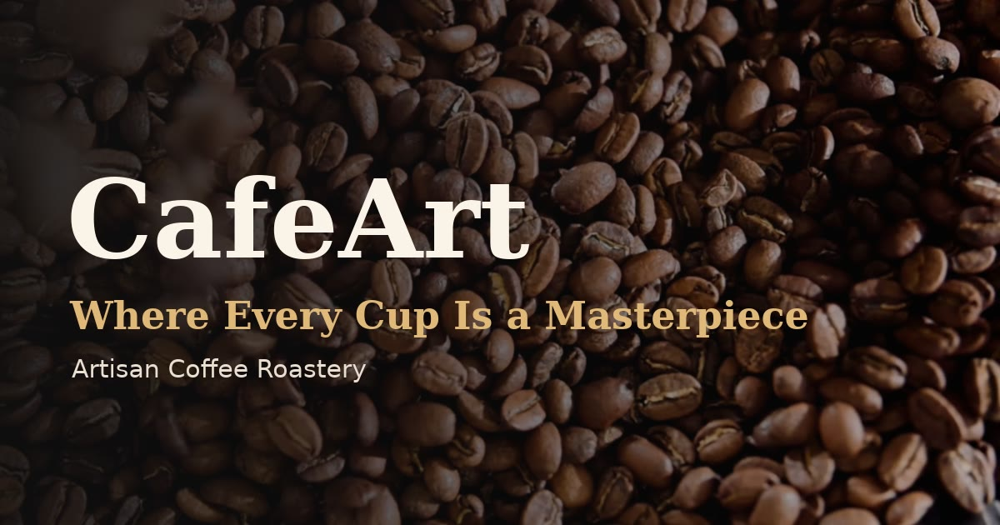

# ☕ CafeArt — *Where Every Cup Is a Masterpiece*

A cinematic, single-page website for an artisan coffee roastery. Built with
**vanilla HTML, CSS, and JavaScript** — no build step, no framework — fronted by
a full-bleed **looping video hero** and real coffee photography throughout.



---

## ✨ Highlights

- **Cinematic video hero** — full-screen autoplay/muted/looping roast footage
  with a Ken-Burns drift, warm grade, and a scrim that keeps the headline crisp.
  A poster frame loads instantly and stands in if the video can't play. A
  lighter **720p source** is served to phones; reduced-motion holds a still.
- **Real photography** across the story, menu (9 drinks), gallery, and a
  panorama behind the craft steps.
- **Fast & accessible images** — every photo is a lazy-loaded `<picture>` with a
  **WebP** source + JPEG fallback, explicit dimensions (no layout shift), and
  alt text.
- **Gallery lightbox** — click/tap or keyboard (Enter) to enlarge; arrow keys /
  on-screen arrows to browse; Esc or backdrop to close.
- **Rich motion** — animated loader, scroll reveals, count-up stats, flavour
  marquee, custom cursor, 3D-tilt menu cards with live category filtering, and a
  rotating testimonial carousel with monogram avatars + an "as featured in" strip.
- **Working reservation form** — progressive-enhancement submit wired for
  **Formspree _or_ Netlify Forms** (with honeypot), graceful demo mode until you
  connect a backend.
- **Found & shareable** — Open Graph/Twitter cards with a generated share image,
  `CafeOrCoffeeShop` **JSON-LD** structured data (hours, address, geo, menu),
  canonical URL, `robots.txt`, and `sitemap.xml`.
- **Installable PWA** — web manifest + maskable icons + `apple-touch-icon`.
- **Bilingual (English / Čeština)** — an EN/CS toggle in the nav translates the
  whole page (including the JS-built menu and form messages), remembers your
  choice, and auto-detects Czech browsers. Adding more languages is one object
  in `js/i18n.js`.
- **Considerate** — responsive, keyboard-reachable (skip link, focus styles),
  `prefers-reduced-motion` aware, touch-friendly.

---

## 🚀 Running it

No build step. Serve the folder over HTTP (autoplay, the lightbox, and relative
paths behave most reliably that way):

```bash
python3 -m http.server 8000     # or: npx serve .
```

Then open <http://localhost:8000>.

---

## ✅ Before you launch (config checklist)

1. **Domain** — replace `https://cafeart.coffee/` in `index.html` (canonical,
   Open Graph, Twitter, JSON-LD), `robots.txt`, and `sitemap.xml` with your URL.
2. **Photos** — the demo imagery is **AI-generated**. Swap `assets/img/*` and the
   hero video/poster for your own or licensed shots before publishing.
3. **Reservation form** — pick one:
   - **Formspree:** set the form's `action="https://formspree.io/f/XXXX"` in
     `index.html` (replace `your-form-id`). That's it — JS submits via fetch.
   - **Netlify:** deploy on Netlify; the `data-netlify="true"` + hidden
     `form-name` are already in place. Submissions appear in your Netlify dashboard.
   - Until configured, the form runs in **demo mode** (friendly confirmation, no send).
4. **Map** — the Visit section embeds Google Maps by address query; update the
   `src` in the `.visit__map` iframe to your exact location (or paste an embed).
5. **Details** — address, hours, phone (`tel:`), email (`mailto:`), and social
   links live in the Visit section + footer.

---

## 📦 Deploying

It's a fully static site — host the folder anywhere.

- **GitHub Pages (included):** a workflow at `.github/workflows/pages.yml`
  deploys on push. In the repo, set **Settings → Pages → Source: GitHub Actions**.
- **Netlify / Vercel / Cloudflare Pages:** "Import repository", framework =
  *None/Static*, build command = *(none)*, publish directory = `/`.

---

## 🗂️ Project structure

```
CafeArt/
├── index.html                  # all sections + head (SEO/OG/JSON-LD/PWA)
├── manifest.webmanifest        # PWA manifest
├── robots.txt · sitemap.xml    # crawler hints
├── css/style.css               # design tokens, layout, animations, lightbox
├── js/i18n.js                  # EN/CS translations + language switcher
├── js/main.js                  # loader, nav, reveals, menu, lightbox, form…
├── .github/workflows/pages.yml # GitHub Pages deploy
└── assets/
    ├── hero.mp4 · hero-720.mp4 · hero-poster.jpg   # hero video + poster
    ├── og-image.jpg            # 1200×630 social share image
    ├── favicon.svg · apple-touch-icon.png · icon-192/512.png
    └── img/                    # story / gallery / menu photos (.jpg + .webp)
```

---

## 🔧 Customising

| Want to change… | Where |
| --- | --- |
| Colours / fonts / radii | CSS variables at the top of `css/style.css` |
| Hero footage | replace `assets/hero.mp4`, `assets/hero-720.mp4`, `assets/hero-poster.jpg` |
| Menu items, prices, photos | the `MENU` array in `js/main.js` |
| Gallery photos / captions | the `#galleryGrid` figures in `index.html` |
| Testimonials | the `.quote` blocks in `index.html` |
| Press logos | the `.press__logos` list in `index.html` |
| Translations / add a language | the `I18N` object in `js/i18n.js` (mark new text with `data-i18n`) |

### Media recipes (ffmpeg)

```bash
# Hero video (desktop + mobile) — no audio, fast-start
ffmpeg -i clip.mp4 -map 0:v:0 -c:v libx264 -crf 27 -preset slow -pix_fmt yuv420p -movflags +faststart assets/hero.mp4
ffmpeg -i clip.mp4 -map 0:v:0 -vf scale=1280:720 -c:v libx264 -crf 28 -preset slow -pix_fmt yuv420p -movflags +faststart assets/hero-720.mp4
ffmpeg -ss 2 -i clip.mp4 -frames:v 1 -q:v 3 assets/hero-poster.jpg
# WebP for a photo
ffmpeg -i photo.jpg -c:v libwebp -quality 80 photo.webp
```

---

## 📦 Third-party

- **Hero footage & photos** — demo media (roast footage + AI-generated stills);
  replace with your own/licensed assets before publishing.
- **Google Fonts** — Playfair Display, Poppins, Caveat; the site degrades to
  system fonts gracefully.
- **Google Maps** — keyless address embed in the Visit section.

---

*Brewed with ☕.*
